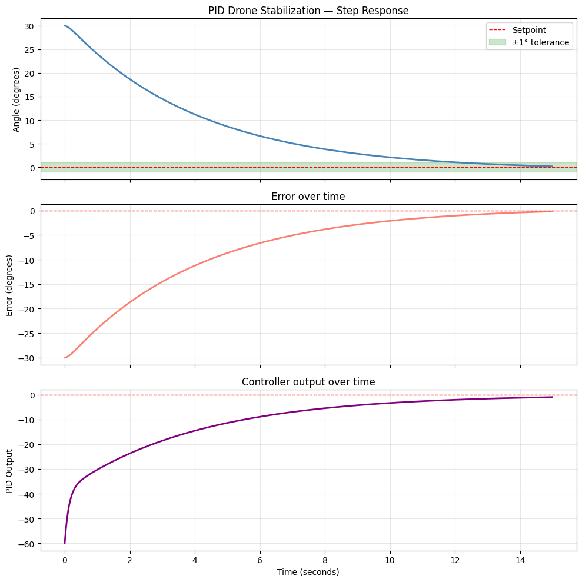

# 🚁 PID Drone Stabilization

Simulating a drone stabilizing its roll angle using a PID 
(Proportional-Integral-Derivative) controller — the most widely 
used control algorithm in robotics, aerospace and automation.

## 🔬 Background

A drone tilted by a wind disturbance must correct its angle back 
to level using rotor thrust adjustments. The PID controller 
continuously calculates how much correction to apply based on 
three terms:

$$\boldsymbol{output = K_p \cdot e(t) + K_i \cdot \int e(t) \, dt + K_d \cdot \frac{de(t)}{dt}$$

Where:
- **Error Definition:** $$e(t) = \text{setpoint} - \text{current angle}$$
- $K_p$   = proportional gain → reacts to current error
- $K_i$   = integral gain     → corrects accumulated drift
- $K_d$   = derivative gain   → dampens rate of change

Mathematically identical to a **damped harmonic oscillator** in 
classical mechanics — Kd plays the role of the damping coefficient.

## 📊 Results

### Step Response (30° initial tilt → 0°)



| Parameter | Value |
|---|---|
| Initial tilt | 30° |
| $K_p$ | 2.0 |
| $K_i$ | 0.01 |
| $K_d$ | 3.0 |
| Settled within ±1° at | ~13 seconds |
| Overshoot | None |

## 🧠 Physics Concepts Demonstrated

- **PID control** — three-term feedback controller
- **Damped harmonic oscillator** — $K_d$ as damping coefficient
- **Step response** — system response to a sudden disturbance
- **Steady state error** — residual offset corrected by Ki term
- **Settling time** — time to reach and stay within tolerance

## 🔑 Key Insight

The three gains trade off against each other:
- High $K_p$ → fast response but oscillates
- High $K_i$ → eliminates drift but overshoots
- High $K_d$ → smooth damping but slow response

Finding the right balance — called **PID tuning** — is one of the 
core challenges in real robotics engineering.

## 🌍 Real World Applications

- Drone and quadcopter flight controllers (ArduPilot, PX4)
- Rocket attitude control (SpaceX Falcon 9 landing)
- Industrial robot arm positioning
- Autonomous vehicle steering
- Satellite attitude control

## 🛠️ Tech Stack

- Python 3.11.9
- NumPy
- Matplotlib

## ▶️ How to Run

```bash
pip install numpy matplotlib
```
Open `notebooks/01_pid_basics.ipynb` and run all cells in order.
